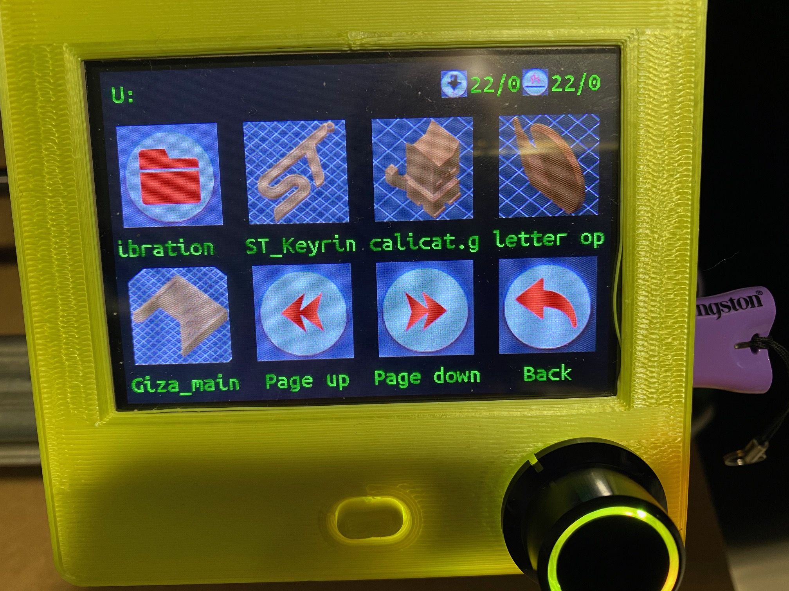
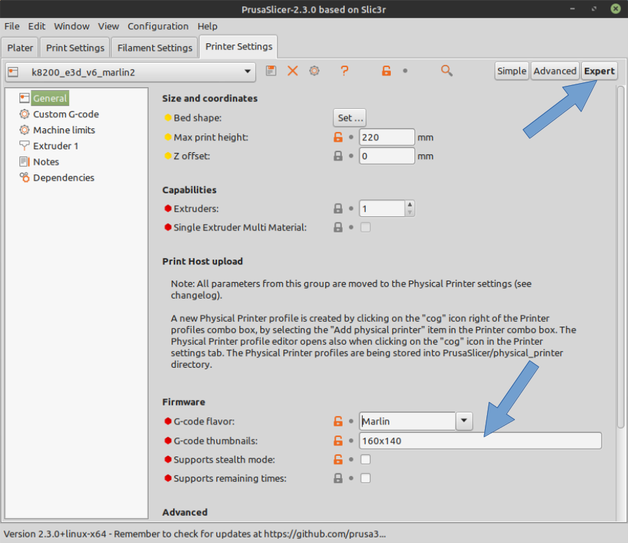
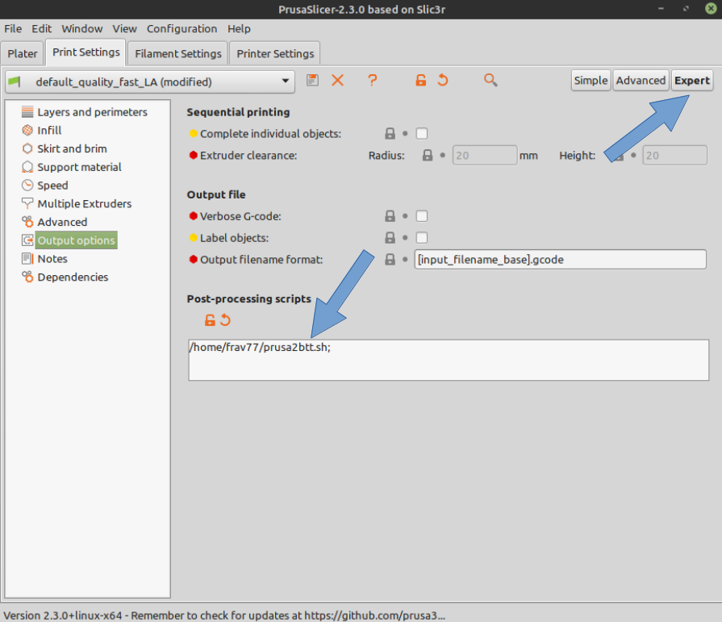

# BTT-TFT35-PrusaSlicer-preview
Linux converter PrusaSlicer thumbnails into BTT-TFT format

This script can extract PrusaSlicer thumbnails from gcode, convert in
a way readable by BTT TFT35 display and reassemble the gcode.

What you can get at the end is this:

## How to install

Ensure to have ImageMagick installed:

``sudo apt install imagemagick``

Copy `prusa2btt.sh` to your home directory and make it executable:

``chmod 755 prusa2btt.sh``

Open PrusaSlicer and enable *Expert* menu in Printer Settings profile
and chose *160x140* thumbnails size

Then go to Print Settings, enable *Expert* menu and write the full path
of the `prusa2btt.sh` script into the Post-processing scripts box

## How to use

Simply slice your project and save the gcode to destination device, all 
the needed tasks are done by `prusa2btt.sh`

enjoy your TFT35 display :)
